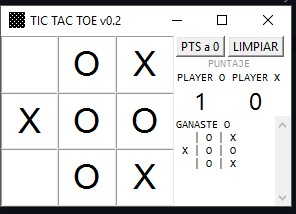
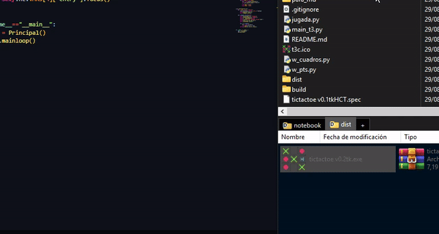

# TIC TAC TOE v0.2

echo con tkinter y python 3.9.12 (no nesecita librerias externas)

## Caracteristicas

* al pasar el cursor sobre los campos muestra que figura se colocara (**X** ó **O**)
* se intercala aumaticamente entre O y X
* mustra puntajes de los signos
* muestra historial de las jugadas ganadoras
* cuando se gana luego de tres segundos se borran los campos, para un nuevo juego
* se puede llenar los campos con el mouse o con el teclado numerico (el orden de los campos esta del mismo modo que el teclado numerico)
* tiene un boton para para reiniciar los puntajes
* un boton para borrar los campos, para un juego nuevo

el ejecutable es solo un archivo no nesecita otros archivos y no hay que instalar nada

